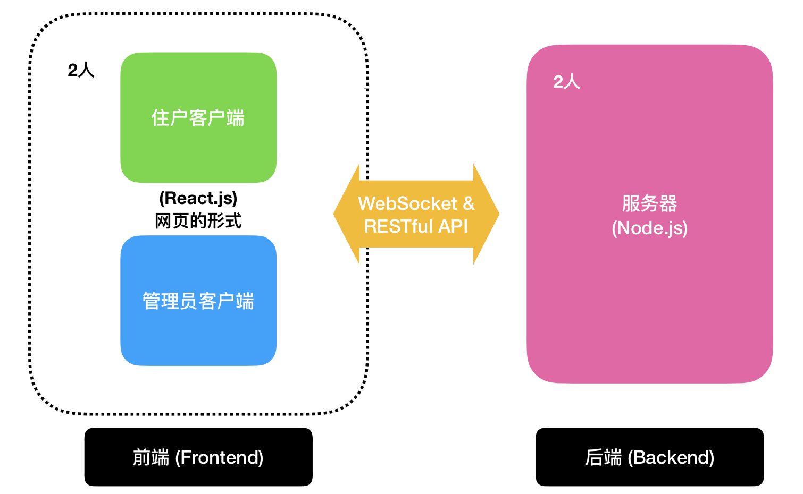

# 分布式温控系统解决方案

2017211317 班 C 组

## 修改历史

| 修改人   | 版本  | 修改时间   | 描述                       |
| -------- | ----- | ---------- | -------------------------- |
| 邱建鑫   | 1.0.0 | 2020-03-12 | 发布第一版系统解决方案     |
| 曾莉慧瑶 | 0.5.0 | 2020-03-12 | 增加技术选型               |
| 赵子豪   | 0.4.0 | 2020-03-12 | 增加功能需求               |
| 申茜     | 0.3.0 | 2020-03-12 | 增加非功能性需求和其他需求 |
| 汪桐     | 0.2.0 | 2020-03-11 | 增加文档介绍               |
| 邱建鑫   | 0.1.0 | 2020-03-09 | 创建解决方案               |

> 如何修改版本号？
>
> 版本号的格式为：主版本号.次版本号.修订号
>
> - 添加内容时，迭代次版本号，如 0.1.2 → 0.2.0；
> - 修改错误时，迭代修订号，如 0.1.2 → 0.1.3；
> - 提交给老师时，迭代主版本号，如 0.2.2 → 1.0.0。

## 目录

[TOC]

## 文档介绍

### 文档目的

本文档提供一套自助计费式中央温控系统的系统解决方案。入住的客户可以根据要求设定**温度**和**风速**的调节，同时可以**显示所需支付的金额**。客户退房时酒店可出具空调使用的**账单**及**详单**。空调运行期间，空调管理员能够**监控**各房间空调的使用状态，需要的情况下可以生成**格式统计报表**。

此文档旨在解读客户的目标与需求，并结合现实世界中的分布式温控系统，探索本项目的解决方案；同时确定系统开发的技术路线，之后的软件开发奠定基础。

### 文档范围

结合现实情况，分析客户的各项需求；同时从需求出发，全面确定技术选型和路线。

### 读者对象

#### 客户-酒店方，包括酒店经理与空调管理员

1. 要求节能、绿色、环保；
2. 要求性价比高，管理方便；
3. 要求能够监控各房间空调的使用状态；
4. 要求能够查看不同时间范围内的格式化统计报表；
5. 要求能够生成账单与详单。

#### 最终用户-住户

1. 要求服务优质；
2. 要求服务价格在可接受范围内。

## 功能性需求

### 主控端

#### 控制模块

收集数据，控制各空调终端。

| 功能名称     | 描述                                                                 |
| ------------ | -------------------------------------------------------------------- |
| 数据采集     | 采集各房间数据，监控空调运行状态                                     |
| 温度数据采集 | 采集各房间当前温度和空调目标温度                                     |
| 风速数据采集 | 采集各房间设置的风速                                                 |
| 空调控制     | 接收各个从控端发出的温度设置请求和关机请求，并按照要求调节各空调终端 |

#### 主控管理模块

主控端管理模块面向酒店前台及系统管理人员，提供对客户的操作界面。

| 功能名称       | 描述                                                                                         |
| -------------- | -------------------------------------------------------------------------------------------- |
| 管理员注册功能 | 允许新的管理人员注册账户并且设置登陆权限和密码                                               |
| 管理员鉴权     | 管理人员进行操作时的身份认定                                                                 |
| 用户注册和注销 | 新用户入住酒店时提供身份认定和对应房间空调控制权，退房时注销相关用户并清空相应空调的缴费信息 |
| 统计功能       | 维护信息表，统计用户的总数、身份信息、对应房间和空调缴费金额，以及管理员的总数和身份信息     |

#### 计费模块

统计各从控端的计费数据，提供支付管理功能。

| 功能名称 | 描述                             |
| -------- | -------------------------------- |
| 计费统计 | 统计各房间所需支付金额           |
| 支付通知 | 监控各房间账户余额并发出缴费通知 |
| 收费管理 | 管理空调收费财务流水             |

### 从控端

#### 从控管理模块

从控管理模块向酒店住户提供空调的状态显示，提供空调控制功能。

| 功能名称       | 描述                                                             |
| -------------- | ---------------------------------------------------------------- |
| 温度检测与显示 | 实时收集各房间当前温度并显示                                     |
| 温度设置       | 允许用户设置空调模式（制冷、制热）和目标温度，并发送请求给主控端 |
| 风速设置       | 允许用户设置风速（高风、中风、低风），并发送请求给主控端         |
| 关机           | 允许用户关闭空调，并发送关机请求给主控端                         |

#### 缴费模块

住户支付相关功能。

| 功能名称 | 描述                                           |
| -------- | ---------------------------------------------- |
| 费用显示 | 在住户使用空调时，实时显示账户余额             |
| 缴费功能 | 在住户余额不足或退房时出具账单，并提供缴费渠道 |

## 非功能性需求

| 需求类型 | 描述                                                         |
| :------: | ------------------------------------------------------------ |
| 性能需求 | 1. 在大部分情况下，保证系统的响应时间在一定范围以内； 2. 拥有应对大规模并发请求的能力，保证系统不会在大量用户的同时请求下崩溃。 |
|  安全性  | 1. 网络传输数据应经过加密，保证数据在采集、传输、处理过程中不被偷窥、窃取、篡改。同时在本地存储数据时也应进行加密，确保不可破解； 2. 严格权限访问控制，用户在经过身份认证后，只能访问其权限范围内的数据，只能进行其权限范围内的操作； 3. 监控各从控机使用情况，发现异常数据时及时报警； 4. 能经受住来自互联网的一般性恶意攻击，如病毒等。 |
|  可靠性  | 1. 在系统出错时，不影响用户的行为操作和数据； 2. 系统故障率需保持在一定的水平下； 3. 要求系统 7x24 小时运行，全年持续运行故障停运时间累计不能超过 10 小时。 |
|  健壮性  | 在系统发生故障后，能快速重建其性能水平，并恢复直接受影响数据。 |
|  易用性  | 1. 在使得主从控机的操作尽可能简单易懂的同时，对其提供详细的使用说明，保证管理员及房客能够快速明白使用方法，且能快捷简便地使用； 2. 对用户的误操作提供防御机制，尽可能避免因用户误操作带来的系统崩溃； 3. 界面简洁清晰，美观实用，各功能按钮在界面中合理分布; 4. 主控机能够直观清晰地显示各个从控机的状态，各机器的能耗统计数据及费用报表。 |
| 可维护性 | 1. 提供运行日志管理功能，可追踪系统的历史使用情况，使维护人员可以通过日志快速发现问题所在，并及时修复系统； 2. 代码应规范简洁，逻辑清晰，注释清楚，结构明了，易于看懂； 3. 各模块之间松耦合。 |
|  兼容性  | 系统应能够在不同平台及操作系统下使用，在少量修改甚至不作修改之后就可以方便快捷地部署在不同的软硬件平台上。 |
| 可伸缩性 | 可通过增加资源满足不断增长的对性能和功能的要求，也可通过缩减资源降低成本。 |
| 可拓展性 | 系统应具有支持技术和业务需求变化的能力。因此，系统设计实现时应尽可能降低各模块及软硬件间的耦合性，在系统架构上考虑，使得系统能以尽量少的代价适应技术与需求的变化。 |

## 其他需求

在满足以上需求的同时，尽可能降低系统开发运行的成本，缩短开发时间。

## 技术选型与技术路线

我们整体采用 Web 技术栈及前后端分离的架构。
核心思想是前端 HTML 页面通过 AJAX 调用后端的 RESTful API 接口并使用 JSON 数据进行交互。通过 WebSocket 实现后端向前端推送消息。

系统整体技术架构如图所示：

### 前端技术选型

#### React

是 Facebook 推出的一个用来构建用户界面的 JavaScript 库。设计思想先进，性能出众，代码逻辑简单。React 采用了虚拟 DOM 的技术来加速网页渲染，其以面向对象的思想，将代码封装成组件，实现了组件的抽象与复用。

其具有以下优点：

- 能够很好的和现有的代码结合。React 只是 MVC 中的 View 层，对于其他的部分并没有硬性要求；
- 组件逻辑使用 JavaScript 编写而非模版，可以轻松地在应用中传递数据，并使得状态与 DOM 分离；
- 能够实现服务器端的渲染，便于搜索引擎优化。

#### Ant Design

Ant Design 是蚂蚁金服开发和正在使用的一套企业级的前端设计语言，基于 React 的前端框架实现。

其具有以下优点：

- 企业级金融产品的交互语言和视觉体系；
- 丰富实用的 React UI 组件；
- 基于 React 的组件化开发模式；
- 背靠 NPM 生态圈；
- 基于 WebPack 的调试构建方案，支持 ES6。

### 后端技术选型

#### Node.js

是能够在服务器端运行 JavaScript 的开放源代码、跨平台 JavaScript 运行环境。Node.js 采用 Google 开发的 V8 运行时，使用事件驱动、非阻塞和异步输入输出模型等技术来提高性能。

其具有以下优点：

- V8 引擎本身使用了一些最新的编译技术。这使得用 Javascript 这类脚本语言编写出来的代码运行速度获得了极大提升，又节省了开发成本；
- Node 采用了一个称为“事件循环(event loop）”的架构，使得编写可扩展性高的服务器变得既容易又安全；
- Node 采用一系列“非阻塞”库来支持事件循环的方式，模型以可扩展的方式简化了对慢资源的访问， 直观，易懂。

#### NestJS

Nest 是一个用于构建高效，可扩展的 Node.js 服务器端应用程序的框架。它使用渐进式 JavaScript，内置并完全支持 TypeScript 并结合了面向对象编程、函数式编程和函数式响应编的元素。

其具有以下优点：

- 提供了一个开箱即用的应用程序架构，允许开发人员和团队创建高度可测试，可扩展，松散耦合且易于维护的应用程序；
- 可测试性强；
- 原生支持 TypeScript；
- 可基于 Express 或者 fastify。

### 版本管理与团队协作

#### Git

是一款免费、开源的分布式版本控制系统，用于敏捷高效地处理任何或小或大的项目。它采用了分布式版本库的方式，不必服务器端软件支持，使源代码的发布和交流极其方便。

团队协作上，我们决定使用 Git，在 GitHub 上进行协作。有以下几点好处：

- 版本管理。考虑到团队的人数，使用 Git 能够减少多人代码覆盖导致的混乱；
- GitHub 具有完善的 Pull Request 功能，可以针对代码与文档进行评论和 review，流程十分清晰；
- 每个人的贡献度都能在上面有追踪和体现。小到每一行代码、大到每个人的百分比，GitHub 都提供了统计功能。
